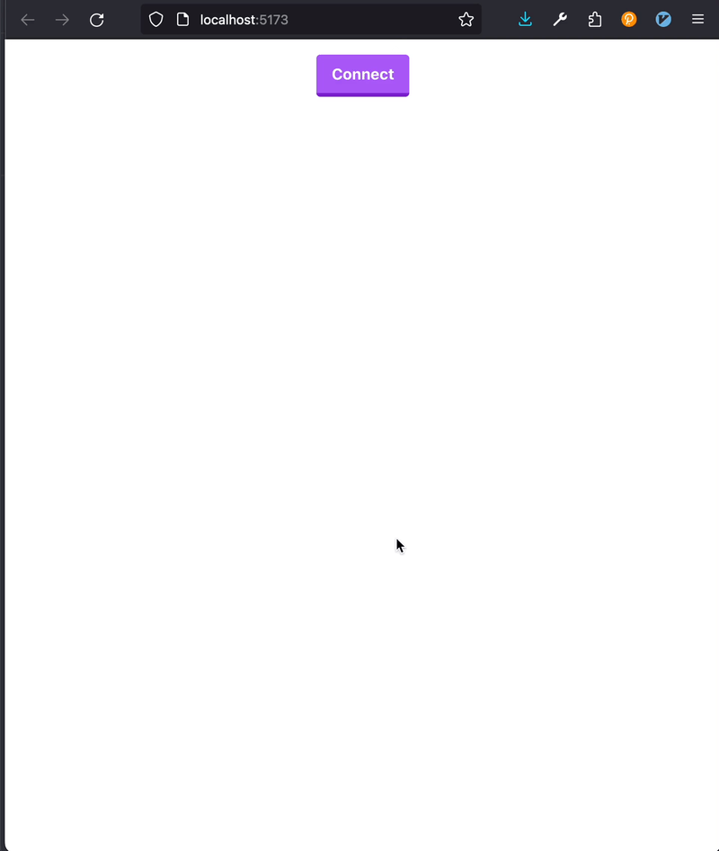

# ink! Frontend Example

This is a vanilla [vite + typescript](https://vitejs.dev/) project to showcase the use of [`useinkathon`](https://github.com/scio-labs/use-inkathon).

## Getting Started

You can use the package manager of your choice to install the dependencies and start the project in development mode. We like `pnpm` right now. But this example should work with `npm` & `yarn` as well.

```sh
pnpm install
pnpm dev
```

## Change the Code

The actual interaction with the contract is all contained in the `./src/App.tsx` file. Every other file in the folder is only relevant for styling and bundling.

## Demo

