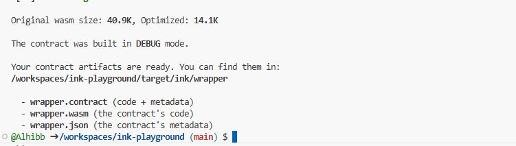
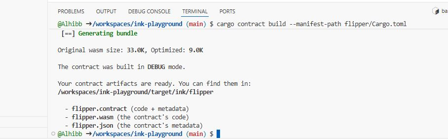
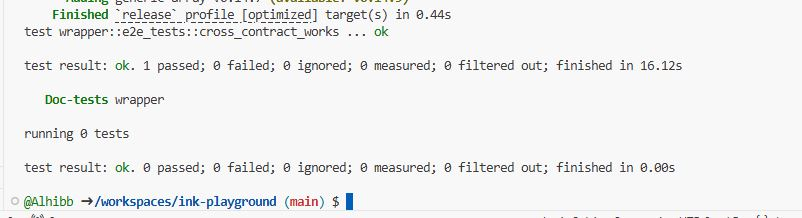

# Mastering End-to-End (E2E) Testing: Cross-Contract Calls

### What is this tutorial about? What will the reader learn?
Unit tests are great for checking logic in isolation, but smart contracts rarely live alone. They talk to other contracts. In this tutorial, you will learn how to use the `ink_e2e` framework to test interactions between two separate smart contracts running on a local Substrate node.

You will learn how to:
1. Set up a Cargo Workspace with two contracts (a **Callee** and a **Caller**).
2. Configure `ink_e2e` (v5.x) to handle multiple contract artifacts.
3. Write an async test that uploads contract code, instantiates contracts, and verifies that a call to Contract A successfully modifies the state of Contract B.

### Prerequisites
*   **Rust & Cargo**: Installed and up to date.
*   **cargo-contract**: Version 4.0 or higher.
*   **Substrate Contracts Node**: You must have the binary installed in your system PATH.
    *   *Linux/WSL/Codespaces:* Download the latest binary from [Releases](https://github.com/paritytech/substrate-contracts-node/releases), extract it, and move it to `/usr/local/bin`.
*   **Basic Knowledge**: You should know how to write a simple "Flipper" contract in ink!.

---

### Body

#### Step 1: Set Up the Workspace
When testing cross-contract calls, it is best practice to use a Cargo Workspace. This allows you to compile both contracts and run tests from a central location.

Create a new directory and a `Cargo.toml` file:

```toml
# Cargo.toml
[workspace]
members = [
    "flipper",
    "wrapper"
]
resolver = "2"
exclude = ["target"]
```

Now, generate the two contracts inside this folder:
```bash
cargo contract new flipper
cargo contract new wrapper
```

#### Step 2: The "Callee" Contract (Flipper)
Let's prepare the contract that will be called. This is a standard Flipper contract. Go to `flipper/lib.rs`.

```rust
#![cfg_attr(not(feature = "std"), no_std, no_main)]

#[ink::contract]
pub mod flipper {
    #[ink(storage)]
    pub struct Flipper {
        value: bool,
    }

    impl Flipper {
        #[ink(constructor)]
        pub fn new(init_value: bool) -> Self {
            Self { value: init_value }
        }

        #[ink(message)]
        pub fn flip(&mut self) {
            self.value = !self.value;
        }

        #[ink(message)]
        pub fn get(&self) -> bool {
            self.value
        }
    }
}
```
*Compile this contract to ensure it builds:* `cargo contract build --manifest-path flipper/Cargo.toml`

#### Step 3: The "Caller" Contract (Wrapper)
The `wrapper` contract needs to interact with `flipper`. 

1. **Add Dependency**: Open `wrapper/Cargo.toml` and add `flipper` as a dependency.
```toml
[dependencies]
ink = { version = "5.1.1", default-features = false }
# ... other deps
flipper = { path = "../flipper", default-features = false, features = ["ink-as-dependency"] }

[dev-dependencies]
ink_e2e = "5.1.1"

[features]
std = [
    "ink/std",
    "scale/std",
    "scale-info/std",
    "flipper/std", # <--- IMPORTANT: Link the std feature of the dependency
]
```

2. **Implement Logic**: In `wrapper/lib.rs`, we will store the `AccountId` of the flipper contract and cast it to a reference when needed.

```rust
#![cfg_attr(not(feature = "std"), no_std, no_main)]

#[ink::contract]
pub mod wrapper {
    use flipper::flipper::FlipperRef;
    use ink::env::call::FromAccountId;
    use ink::ToAccountId;

    #[ink(storage)]
    pub struct Wrapper {
        flipper_account: AccountId,
    }

    impl Wrapper {
        #[ink(constructor)]
        pub fn new(flipper_code_hash: Hash) -> Self {
            // Instantiate Flipper from within Wrapper
            // We use the builder pattern provided by the generated code
            let flipper = FlipperRef::new(true)
                .code_hash(flipper_code_hash)
                .endowment(0)
                .salt_bytes([0xDE, 0xAD, 0xBE, 0xEF])
                .instantiate();
            
            Self { flipper_account: flipper.to_account_id() }
        }

        #[ink(message)]
        pub fn proxy_flip(&mut self) {
            let mut flipper: FlipperRef = FromAccountId::from_account_id(self.flipper_account);
            flipper.flip();
        }

        #[ink(message)]
        pub fn proxy_get(&self) -> bool {
            let flipper: FlipperRef = FromAccountId::from_account_id(self.flipper_account);
            flipper.get()
        }
    }
    
    // E2E Tests will go here...
}
```

#### Step 4: Writing the E2E Test
We will use `ink_e2e` to test the interaction on a live node. Add this module to the bottom of `wrapper/lib.rs`.

Note: In ink! 5.x, we use `.call_builder::<Contract>()` to create valid calls for the client.

```rust
#[cfg(all(test, feature = "e2e-tests"))]
mod e2e_tests {
    use super::*;
    use ink_e2e::ContractsBackend;

    type E2EResult<T> = std::result::Result<T, Box<dyn std::error::Error>>;

    #[ink_e2e::test]
    async fn cross_contract_works(mut client: ink_e2e::Client<C, E>) -> E2EResult<()> {
        // 1. Upload Flipper Code
        let flipper_hash = client
            .upload("flipper", &ink_e2e::alice())
            .submit()
            .await
            .expect("uploading flipper failed")
            .code_hash;

        // 2. Instantiate Wrapper
        // We create a constructor builder
        let mut constructor = WrapperRef::new(flipper_hash);
        
        let wrapper_contract = client
            .instantiate("wrapper", &ink_e2e::alice(), &mut constructor)
            .submit()
            .await
            .expect("wrapper instantiate failed");

        // 3. Verify Initial State via Wrapper
        // Use call_builder to generate the specific call object
        let get_call = wrapper_contract.call_builder::<Wrapper>().proxy_get();
        
        let get_res = client
            .call(&ink_e2e::alice(), &get_call)
            .submit()
            .await
            .expect("call failed");
            
        assert_eq!(get_res.return_value(), true);

        // 4. Call proxy_flip via Wrapper
        let flip_call = wrapper_contract.call_builder::<Wrapper>().proxy_flip();
        
        let _ = client
            .call(&ink_e2e::alice(), &flip_call)
            .submit()
            .await
            .expect("flip failed");

        // 5. Verify State Changed
        let get_call_2 = wrapper_contract.call_builder::<Wrapper>().proxy_get();
        
        let get_res_2 = client
            .call(&ink_e2e::alice(), &get_call_2)
            .submit()
            .await
            .expect("call failed");
            
        assert_eq!(get_res_2.return_value(), false);

        Ok(())
    }
}
```

Run the test with:
`cargo test --manifest-path wrapper/Cargo.toml --features e2e-tests`

---

### Conclusion
You have successfully implemented an End-to-End test for a cross-contract interaction! 

**Key Takeaways:**
1.  **Real Environment**: `ink_e2e` tests strictly enforce chain rules like gas limits and instantiation logic.
2.  **Workflow**: The standard pattern is `Upload Dependency` -> `Get CodeHash` -> `Instantiate Main Contract` -> `Call`.
3.  **Call Builders**: In modern ink! (v5+), use `.call_builder::<Contract>()` to construct type-safe calls for your tests.


---
### Reference Code & Results
If you get stuck, you can find the complete working code for this tutorial in the [reference folder](./e2e-cross-contract/).


### How to Run
1.  **Rebuild Flipper:**
    ```bash
    cargo contract build --manifest-path flipper/Cargo.toml
    ```
2.  **Build Wrapper:**
    ```bash
    cargo contract build --manifest-path wrapper/Cargo.toml
    ```
3.  **Run Test:**
    ```bash
    cargo test --manifest-path wrapper/Cargo.toml --features e2e-tests
    ```


Here is what a successful build and test run looks like:

**1. Building the Contracts**
Ensure both contracts build successfully in debug mode.
 
**2. Running the E2E Test**
When you run `cargo test --features e2e-tests`, you should see the node start and the test pass.


---

### Author
**[Ibrahim Rabiu]**
- [GitHub – alhibb](https://github.com/alhibb)  
- [X      – @I_bakondare](https://x.com/I_bakondare)

*Open Source Contributor & ink! Enthusiast*
