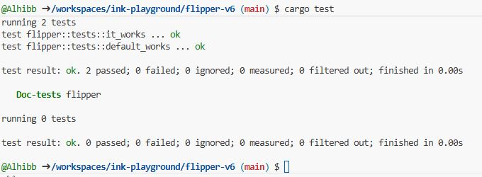

# Flipper Smart Contract (Using ink! v6)

Welcome to the **ink! v6** version of Flipper! 

This is the "Hello, World!" of Polkadot smart contracts. It demonstrates the migration from the old WebAssembly (Wasm) architecture to the new **RISC-V (PolkaVM)** architecture introduced in ink! 6.0.

## Project Structure

- **`lib.rs`**: The logic of the contract. It stores a single boolean value that can be flipped from `true` to `false`.
- **`Cargo.toml`**: The configuration file that specifically targets `ink = "6.0.0-beta"`.

---

## Prerequisites & Installation

To build this project, you need the **ink! v6 toolchain**. If you are using a standard Rust environment (or GitHub Codespaces), follow these steps to set up support for RISC-V.

### 1. Setup Rust Sources
ink! v6 requires the Rust source code to compile the standard library for the PolkaVM target.

```bash
rustup component add rust-src
```

### 2. Install cargo-contract (v6 Beta)
You must install the specific beta version of the contract tool. Older versions will try to compile to Wasm and fail.

```bash
cargo install --force --locked --version 6.0.0-beta cargo-contract
```

---

## How to Run

### 1. Unit Testing
Before compiling the full contract, check if the logic works using standard Rust tests.

```bash
cargo test
```

**Expected Result:**
All tests should pass. This confirms the `flip()` and `get()` logic is correct.



---

### 2. Building the Contract (RISC-V)
This compiles the contract into the format required by the blockchain.

```bash
cargo contract build
```

**Expected Result:**
The build should produce a `.polkavm` file (indicating RISC-V) instead of the old `.wasm` file.


### 3. The Artifacts
After a successful build, your contract files will be in `./target/ink/`:

- **`flipper.contract`**: The full bundle (Code + Metadata). Upload this to the blockchain.
- **`flipper.polkavm`**: The raw RISC-V machine code.
- **`flipper.json`**: The ABI (Metadata) describing the methods.

---


##  Code Overview

If you are new to smart contracts, think of this file structure like a recipe: **`Cargo.toml`** lists the ingredients, and **`lib.rs`** contains the cooking instructions.

### 1. The Ingredients (`Cargo.toml`)
This file tells the Rust compiler what external tools we need.

```toml
[dependencies]
ink = { version = "6.0.0-beta", default-features = false }
```

**What this does:**
- **`ink`**: We are importing the `ink` framework, which provides the tools to write smart contracts on Polkadot.
- **`6.0.0-beta`**: We specify version 6 to ensure we are using the latest engine (RISC-V).
- **`default-features = false`**: Smart contracts run in a tiny, restricted environment (the blockchain). We disable "default features" (like the standard library used for regular computer programs) to keep the contract small and efficient.

---

### 2. The Logic (`lib.rs`)
This is where the magic happens. We are building a **"Flipper"**—imagine a light switch that you can turn ON or OFF.

#### A. The Entry Point
Everything lives inside a module marked with `#[ink::contract]`. This macro tells the compiler: *"Treat this code as a Smart Contract, not a normal Rust program."*

```rust
#[ink::contract]
mod flipper {
    // All contract logic goes here...
}
```

#### B. The Storage (The Memory)
Smart contracts need to save data permanently on the blockchain. We use `#[ink(storage)]` to define what we want to save.

```rust
    #[ink(storage)]
    pub struct Flipper {
        value: bool, // We store a single boolean: true or false
    }
```

#### C. The Setup (Constructor)
When you first upload a contract to the blockchain, you need to initialize it. This is called a **Constructor**. It runs exactly once.

```rust
    impl Flipper {
        #[ink(constructor)]
        pub fn new(init_value: bool) -> Self {
            // We set the initial state to whatever the user provides
            Self { value: init_value }
        }
```

#### D. The Actions (Messages)
Once the contract is live, people can interact with it using **Messages**.

**1. The `flip` message (Writing Data)**
This function uses `&mut self` (mutable), meaning it is allowed to **change** the data in storage. It costs a small fee (gas) to run because it modifies the blockchain state.

```rust
        #[ink(message)]
        pub fn flip(&mut self) {
            self.value = !self.value; // If true, make it false. If false, make it true.
        }
```

**2. The `get` message (Reading Data)**
This function uses `&self` (immutable), meaning it only **reads** data. It does not change anything.

```rust
        #[ink(message)]
        pub fn get(&self) -> bool {
            self.value // simply return the current state
        }
    }
```