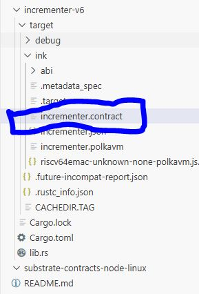

# Incrementer Smart Contract (ink! v6)

Welcome to the second level of ink! v6 development! 

While **Flipper** taught us how to store a single global value, **Incrementer** introduces two massive concepts: **User-Specific Storage** and **Identity**.

In this contract, we build a counter where:
1. There is a **Global** count (shared by everyone).
2. There is a **Personal** count (unique to each specific user).

## Project Structure

- **`lib.rs`**: The logic. Introduces `Mapping` (Database) and `env().caller()` (Identity).
- **`Cargo.toml`**: Targets `ink = "6.0.0-beta"`.

---

## Prerequisites

If you set up your environment for Flipper, you are ready to go! If not, run these commands to enable RISC-V support:

```bash
rustup component add rust-src
cargo install --force --locked --version 6.0.0-beta cargo-contract
```

---

## How to Run

### 1. Unit Testing
Check the logic before compiling. This tests both the global counter and the user-specific logic.

```bash
cargo test
```

**Expected Result:**
All 3 tests should pass (`default_works`, `it_works`, `my_value_works`).


---

### 2. Building the Contract (RISC-V)
Compile the contract for the PolkaVM engine.

```bash
cargo contract build
```

**Expected Result:**
You should see `incrementer.polkavm` in the output.


---

## Code Overview: What's New?

### 1. The "Phonebook" (Mapping)
In Flipper, we stored one `bool`. Here, we need to store a number for *Alice*, a number for *Bob*, and a number for *Charlie*.

We use **`Mapping`**. Think of it like a phonebook or a database.

```rust
use ink::storage::Mapping;

#[ink(storage)]
pub struct Incrementer {
    value: i32,                   // Global: Same for everyone
    my_value: Mapping<H160, i32>, // Private: distinct for every user
}
```

### 2. The Address Type (H160)  *Important v6 Change*
In older versions of ink!, addresses were `AccountId`. In **ink! v6**, we use **`H160`** (Ethereum-style 20-byte addresses) to be compatible with the new RISC-V engine.

```rust
use ink::primitives::H160; // We must import this!
```

### 3. Identifying the User (The Caller)
How does the contract know if *Alice* or *Bob* is calling? We ask the environment.

```rust
pub fn inc_mine(&mut self, by: i32) {
    // "Hey Blockchain, who sent this transaction?"
    let caller = self.env().caller(); 
    
    // Look up this specific caller in our "Phonebook"
    let my_val = self.my_value.get(caller).unwrap_or(0);
    
    // Update only their entry
    self.my_value.insert(caller, &(my_val + by));
}
```

---

## Summary of Messages

| Message | Type | Description |
| :--- | :--- | :--- |
| **`inc(by)`** | Write | Adds to the **Global** `value`. Everyone sees this change. |
| **`get()`** | Read | Reads the **Global** `value`. |
| **`inc_mine(by)`** | Write | Identifies **YOU**, looks up **YOUR** number, and increases it. |
| **`get_mine()`** | Read | Identifies **YOU** and returns only **YOUR** number. |

---

### Artifacts
Your compiled files are located in:
`./target/ink/incrementer.contract`


