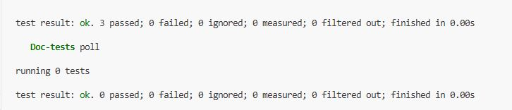
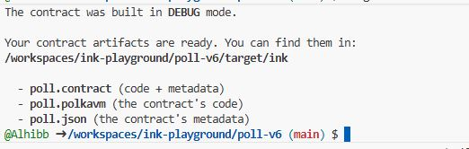

# Secure Poll Contract (Built with ink! v6)


## Project Overview

This project implements a decentralized **Voting System** using **ink! v6**, the latest smart contract language for the Polkadot ecosystem.

Unlike previous versions of ink! that relied on WebAssembly (Wasm), **ink! v6 compiles to RISC-V** to run on **PolkaVM**. This architectural shift (`pallet-revive`) allows for native Solidity ABI compatibility, higher performance, and a future-proof execution environment.

### Core Features
*   **ADMIN Access Control:** strictly restricted capabilities (Start/End Poll) to the contract creator.
*   **State Machine Logic:** The poll transitions between `Closed` → `Open` → `Closed` states.
*   **Double-Voting Prevention:** Utilizes on-chain storage Mappings to track voter participation.
*   **Ethereum Compatibility:** Uses `H160` address types, making the contract compatible with Ethereum wallets (MetaMask) and tools.

---

## Architecture & Logic

The contract is designed with a strict separation of concerns between the **Administrator** and the **Public**.

### 1. Storage Layout
The contract state is stored in the high-performance PolkaVM storage:

```rust
#[ink(storage)]
pub struct Poll {
    admin: H160,                  // The owner (Alice)
    is_active: bool,              // The State Switch
    yes_votes: u32,               // Counter
    no_votes: u32,                // Counter
    has_voted: Mapping<H160, bool> // Anti-Sybil mechanism
}
```

### 2. The "Ensure Admin" Pattern
Security is enforced not by `modifiers` (like in Solidity), but by a Rust helper function that panics or returns an error if the caller is unauthorized.

```rust
fn ensure_admin(&self) -> Result<()> {
    if self.env().caller() != self.admin {
        return Err(Error::NotAdmin);
    }
    Ok(())
}
```

---

## Prerequisites & Setup

Before running this project, ensure your environment is configured for **ink! v6**.

### 1. System Requirements
*   **Rust:** Stable channel.
*   **cargo-contract:** Version 6.0.0-beta (or newer).
*   **ink-node:** The specialized Substrate node supporting `pallet-revive`.

### 2. Installation Commands
```bash
# 1. Update Rust
rustup update
rustup target add wasm32-unknown-unknown
rustup component add rust-src

# 2. Install ink! CLI v6
cargo install --force --locked --version 6.0.0-beta cargo-contract

# 3. Download the ink-node (Linux/Mac)
wget https://github.com/use-ink/ink-node/releases/download/v0.1.0/ink-node
chmod +x ink-node
```

---

## Phase 1: Building and Testing

We utilize Rust's built-in testing framework to simulate blockchain interactions off-chain. This ensures logic allows the Admin to start polls and prevents double voting.

### Running Unit Tests
Execute the test suite to verify the logic:

```bash
cargo test
```

**Expected Output:**
All tests (`admin_can_start_poll`, `voting_works`, `double_voting_fails`) should pass.



### Compiling for Release
Compile the Rust code into a `.contract` bundle (which includes the RISC-V binary and JSON metadata).

```bash
cargo contract build
```

**Successful Build Output:**
Look for the generated files in `./target/ink/`:
*   `poll.contract` (The bundle to upload)
*   `poll.json` (The Metadata/ABI)



---

## Phase 2: Local Blockchain Deployment

This section details how to run the contract on a local development node.

### 1. Start the Local Node
Run the `ink-node` binary in development mode. This creates a temporary blockchain on your machine.

```bash
./ink-node --dev
```

*   **RPC Port:** `9933` (HTTP)
*   **WS Port:** `9944` (WebSocket)

### 2. Configure the UI (ui.use.ink)
We use the hosted interface at **[ui.use.ink](https://ui.use.ink/)**.

1.  Open the URL in Chrome or Firefox.
2.  **Toggle the Version:** Ensure the sidebar toggle is set to **ink! v6**.
3.  **Connect Network:** Click the top-left dropdown and select **Local Node** (`ws://127.0.0.1:9944`).

### 3.  CRITICAL: Wallet Setup (The "Rich Alice" Fix)
*Standard development nodes come with a pre-funded account named Alice. However, browser wallets often import the wrong "derived" path, resulting in a $0 balance.*

To pay for deployment, you must import **Alice's Raw Private Key**:

1.  Open **Polkadot.js Extension** (or SubWallet/Talisman).
2.  Select **"Import Account from Pre-existing Seed"**.
3.  **DO NOT** use the mnemonic words.
4.  **Paste this Hex Seed:**
    ```text
    0xe5be9a5092b81bca64be81d212e7f2f9eba183bb7a90954f7b76361f6edb5c0a
    ```
5.  Name the account **"Real Alice"**.
6.  You should now see a balance of millions of units.

### 4. Upload and Instantiate
1.  Click **"Add New Contract"** -> **"Upload New Contract Code"**.
2.  Upload `poll.contract`.
3.  Select **"Real Alice"** as the deployment account.
4.  Name the instance "My Poll".
5.  Click **Next** -> **Upload and Instantiate**.

![Placeholder: Screenshot of ui.use.ink showing the 'Upload' screen with the Green Checkmark] (./images/upload_success.png)

---

##  Phase 3: Interaction Walkthrough

Once deployed, the contract lands on the "Interact" page. Here is the lifecycle of a poll.

### Step 1: Check Status (Poll Closed)
By default, the poll is inactive.
*   **Message:** `isActive()`
*   **Click:** Read/Call
*   **Result:** `false`

### Step 2: Start the Poll (Admin Only)
Only Alice can do this.
*   **Message:** `startPoll()`
*   **Caller:** Real Alice
*   **Action:** Click **Call Contract** and sign.

### Step 3: Voting (Public Action)
Simulate a user voting "Yes".
*   **Message:** `vote(choice: bool)`
*   **Argument:** `true` (for Yes)
*   **Caller:** Real Alice (or any funded account).
*   **Action:** Click **Call Contract**.

*Note: If you try to vote again with the same account, the transaction will fail with `Error: AlreadyVoted`.*

### Step 4: Live Tally
Check the vote count.
*   **Message:** `getResults()`
*   **Action:** Read
*   **Result:** `(1, 0)` indicating 1 Yes, 0 No.

![Placeholder: Screenshot of 'getResults' output showing (1,0)] (./images/get_results.png)

### Step 5: End Poll
*   **Message:** `endPoll()`
*   **Action:** Call Contract.
*   **Result:** `isActive` returns `false` again. Voting is now disabled.

---

## Troubleshooting Common Errors

During the development of this contract, several specific errors were encountered and resolved.

### 1. `StorageDepositNotEnoughFunds`
**Symptom:** The UI refuses to instantiate the contract, claiming the origin doesn't have enough balance.
**Cause:** You are using the default "Alice" account which has $0 because the derivation path was missing during import.
**Solution:** Import the Account using the **Raw Hex Seed** (provided in the Wallet Setup section above) to access the pre-funded developer funds.

### 2. `WASM interface has not been initialized`
**Symptom:** A Javascript error popup appears when trying to sign a transaction in the browser.
**Cause:** The Polkadot.js cryptography libraries inside the browser haven't loaded before the UI tried to use them.
**Solution:**
1.  Refresh the page (`Ctrl + R`).
2.  Switch the account dropdown to a different user and back to Alice.
3.  Ideally, use a browser extension (SubWallet/Talisman) instead of the UI's built-in "development accounts."

### 3. `Module(NotAdmin)`
**Symptom:** Transaction fails when calling `startPoll` or `endPoll`.
**Cause:** You are calling the function with an account that is not the contract Creator.
**Solution:** Ensure the "Caller" dropdown is set to the same account that instantiated the contract (Alice).

---

## API Reference

| Message Name | Type | Arguments | Returns | Description |
| :--- | :--- | :--- | :--- | :--- |
| `new()` | Constructor | None | Self | Initializes admin as caller. |
| `start_poll()` | Transact | None | Result | **Admin Only.** Resets votes, opens poll. |
| `end_poll()` | Transact | None | Result | **Admin Only.** Closes poll. |
| `vote()` | Transact | `choice: bool` | Result | Records vote. Fails if closed/already voted. |
| `get_results()`| Query | None | `(u32, u32)` | Returns `(yes_votes, no_votes)`. |
| `is_active()` | Query | None | `bool` | Returns `true` if voting is open. |

---

## License

This project is open-source and available under the MIT License.

*Built with ❤️ using [ink!](https://use.ink/) v6.*